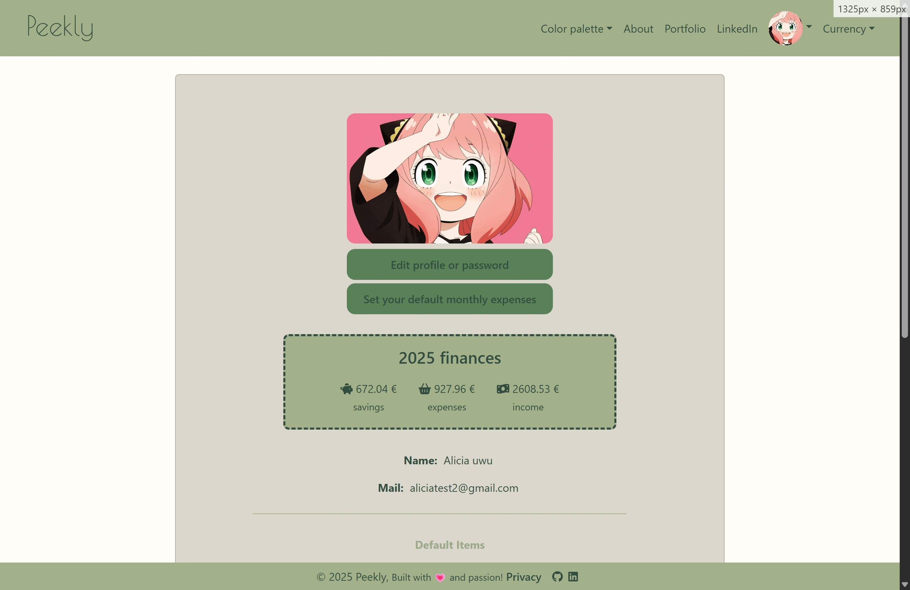
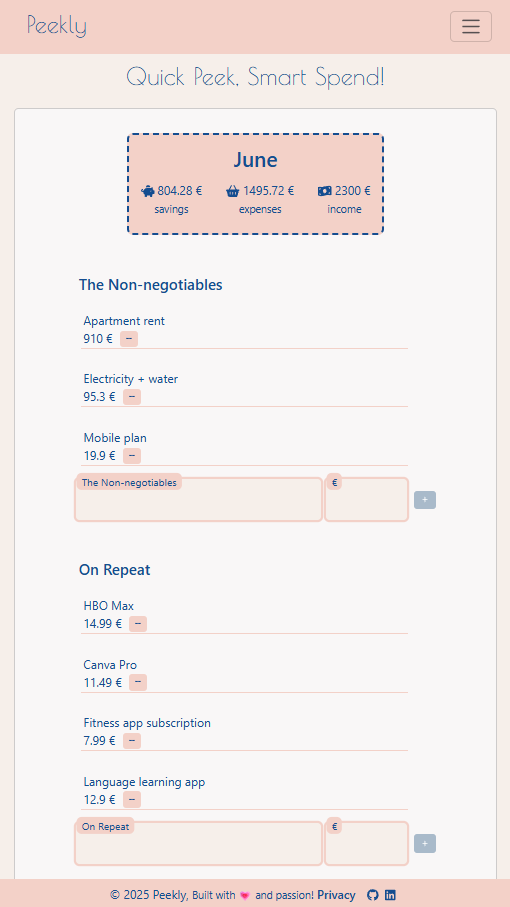

# Peekly 💸

Your **favorite minimalist and cute app** to track expenses and manage your budget effortlessly.  
Whether you’re the “quick add” type who just wants to jot down that coffee, or a detail enthusiast who loves logging every penny (and the exact time you bought it 😎), Peekly has you covered… well, almost — **details on the items are still a WIP xP**.

---

## 🎨 Themes & Cards

Peekly comes with **three theme colors** to suit your style: 2 light modes and 1 dark mode. Cards are neatly organized into **5 expense categories**, so you can always see where your money is going.

  

---

## 🔐 User Accounts & MongoDB

Peekly isn’t just a front-end toy — it’s a **full-stack app with MongoDB**!

- Users can **create accounts** and securely store their expense cards.
- **Custom costs** can be pre-set and automatically added to new cards.
- Users can **add their own avatar** or... that's the idea. For now, everyone will have a cute Anya avatar!

---

## 📆 Cards & Library

- Currently, users can create **one card per month**, but no worries — Peekly will **auto-create it** on your first login of the month.  
- Within each card, you can **add or remove as many items as you want**. The only limit is your real budget… or not! 😅  
- If you want to end the month with **negative savings**, Peekly won’t stop you (although we don’t exactly recommend it 😉).

- All cards are neatly organized in a **library**, and soon you’ll be able to **edit old cards** (for those chocolate bars you forgot to log last Friday 😉).

---

## 📱 Responsive Design

No matter the device, Peekly keeps your expenses readable and easy to navigate. **Even on your phone, your eyes won’t scream at you**.

  

---

## ⚡ Features at a Glance

- Minimalist, fast, and intuitive
- 3 theme colors (2 lights + 1 dark)
- 5 expense categories per card
- Full **backend integration** with MongoDB
- Automatic card creation each month
- Responsive design for all devices
- Future support for **detailed editing of past cards**
- Monthly and yearly summary

## ⚡ Tech Stack

**Frontend:**  
- React – UI components  
- React Router – navigation  
- Axios – API requests  
- Bootstrap / CSS – styling & responsive design  

**State Management:**  
- Redux Toolkit – app-wide state  

**Backend:**  
- Node.js & Express – API server  
- MongoDB – database for users and cards  

**Dev Tools / Environment:**  
- Vite – dev server & bundler  
- ESLint / Prettier – code formatting  
- Git / GitHub – version control

---

Peekly is all about **tracking your expenses without losing your mind** — simple, clean, and a little fun.
